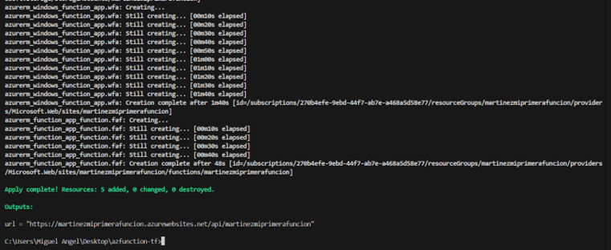

# Proyecto: Despliegue de Infraestructura en Azure con Terraform

En este proyecto se desplegó infraestructura en **Azure** utilizando Terraform como herramienta de **Infraestructura como Código (IaC)**. El flujo seguido fue continuo, desde la preparación del entorno hasta la creación y verificación de los recursos.

Primero se inicializó el proyecto con `terraform init`. Este comando prepara el directorio de trabajo, descarga los proveedores necesarios y configura el backend para almacenar el estado de la infraestructura.  

A continuación, se validó la configuración de los archivos de Terraform con `terraform validate`, lo que permite detectar errores de sintaxis y asegurar que los archivos `.tf` estén correctamente escritos antes de aplicar cambios.  

Después se aplicó `terraform fmt` para formatear automáticamente el código, asegurando consistencia, legibilidad y buenas prácticas en la escritura de los archivos de configuración.  

Antes de planificar la infraestructura, se comprobó la cuenta de Azure activa con `az account list`, para asi poder conocer el id que se debía poner en el subscription_id.

Después, se cambió la región para evitar errores.

Con la cuenta verificada, se generó un plan de ejecución mediante `terraform plan`. Este comando muestra qué recursos serán creados, modificados o eliminados sin aplicar los cambios todavía, permitiendo revisar y confirmar que todo esté correcto. En este proyecto, se asignó a la función el nombre `martinezmiprimerafuncion`.  

Una vez revisado el plan, se aplicó la infraestructura con `terraform apply`. Terraform solicita confirmación mediante `yes` antes de crear los recursos. Este paso crea todos los recursos definidos en los archivos de configuración directamente en Azure.  

Posteriormente, se verificó en el portal de Azure que los recursos se hayan creado correctamente y que la función tenga el nombre asignado. Esto permite asegurarse de que la infraestructura fue desplegada según lo planificado.  

Finalmente, se entró a la página creada y se probó la función.

Todo este flujo asegura que la infraestructura se despliegue de manera segura, automatizada y reproducible, aprovechando los beneficios de Terraform como IaC, incluyendo trazabilidad de cambios, consistencia entre ambientes y facilidad para recrear o modificar la infraestructura de manera controlada. Este proceso permite además versionar el código, mantener buenas prácticas y reducir errores humanos al aplicar cambios en la nube.
